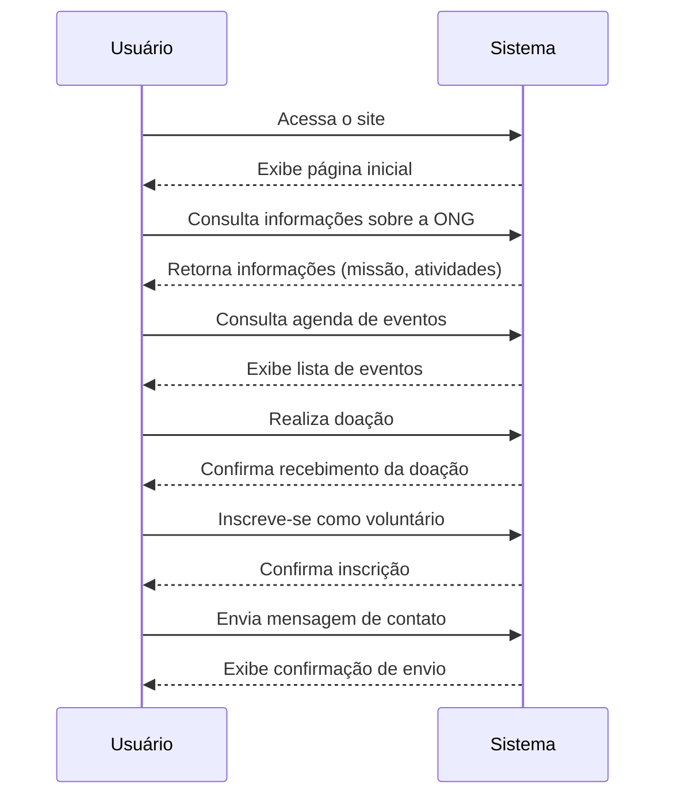
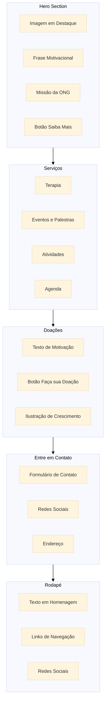

# Diagramas

## Fluxo Usuário

```mermaid

sequenceDiagram
  participant Usuário
  participant Sistema

  Usuário->>Sistema: Acessa o site
  Sistema-->>Usuário: Exibe página inicial

  Usuário->>Sistema: Consulta informações sobre a ONG
  Sistema-->>Usuário: Retorna informações (missão, atividades)

  Usuário->>Sistema: Consulta agenda de eventos
  Sistema-->>Usuário: Exibe lista de eventos

  Usuário->>Sistema: Realiza doação
  Sistema-->>Usuário: Confirma recebimento da doação

  Usuário->>Sistema: Inscreve-se como voluntário
  Sistema-->>Usuário: Confirma inscrição

  Usuário->>Sistema: Envia mensagem de contato
  Sistema-->>Usuário: Exibe confirmação de envio

```
## Modelo MDL

```mermaid

flowchart TB
    %% Configurações de tema e tamanho
    %%{init: {'theme': 'base', 'themeVariables': { 'fontSize': '14px' }}}%%

    subgraph HeroSection ["Hero Section"]
        A1[Imagem em Destaque]
        A2[Frase Motivacional]
        A3[Missão da ONG]
        A4[Botão Saiba Mais]
    end

    subgraph Servicos ["Serviços"]
        B1[Terapia]
        B2[Eventos e Palestras]
        B3[Atividades]
        B4[Agenda]
    end

    subgraph Doacoes ["Doações"]
        C1[Texto de Motivação]
        C2[Botão Faça sua Doação]
        C3[Ilustração de Crescimento]
    end

    subgraph Contato ["Entre em Contato"]
        D1[Formulário de Contato]
        D2[Redes Sociais]
        D3[Endereço]
    end

    subgraph Rodape ["Rodapé"]
        E1[Texto em Homenagem]
        E2[Links de Navegação]
        E3[Redes Sociais]
    end

    %% Relações entre os elementos principais
    HeroSection --> Servicos
    Servicos --> Doacoes
    Doacoes --> Contato
    Contato --> Rodape

```
